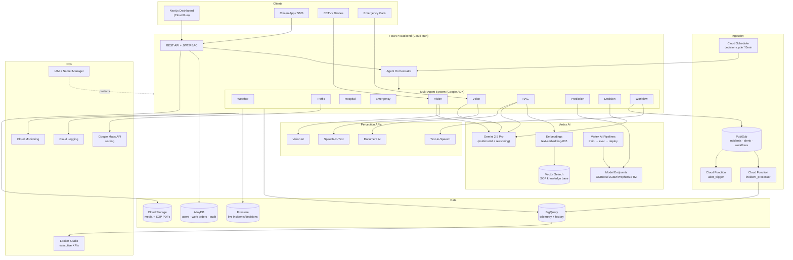

# Sentinel AI — System Architecture

```mermaid
flowchart TB
    subgraph Clients
        WEB["Next.js Dashboard<br/>(Cloud Run)"]
        CITIZEN["Citizen App / SMS"]
        CCTV["CCTV / Drones"]
        CALLS["Emergency Calls"]
    end

    subgraph Ingestion
        PS[("Pub/Sub<br/>incidents · alerts · workflows")]
        CF1["Cloud Function<br/>incident_processor"]
        CF2["Cloud Function<br/>alert_trigger"]
        SCHED["Cloud Scheduler<br/>decision cycle */5min"]
    end

    subgraph Backend["FastAPI Backend (Cloud Run)"]
        API["REST API + JWT/RBAC"]
        ORCH["Agent Orchestrator"]
        subgraph Agents["Multi-Agent System (Google ADK)"]
            A1["Weather"] ; A2["Traffic"] ; A3["Hospital"] ; A4["Emergency"]
            A5["Vision"] ; A6["Voice"] ; A7["RAG"] ; A8["Prediction"]
            A9["Decision"] ; A10["Workflow"]
        end
    end

    subgraph AI["Vertex AI"]
        GEM["Gemini 2.5 Pro<br/>(multimodal + reasoning)"]
        EMB["Embeddings<br/>text-embedding-005"]
        VS[("Vector Search<br/>SOP knowledge base")]
        VP["Vertex AI Pipelines<br/>train → eval → deploy"]
        EP["Model Endpoints<br/>XGBoost/LGBM/Prophet/LSTM"]
    end

    subgraph Perception["Perception APIs"]
        STT["Speech-to-Text"] ; TTS["Text-to-Speech"]
        VIS["Vision AI"] ; DOC["Document AI"]
    end

    subgraph Data
        BQ[("BigQuery<br/>telemetry + history")]
        FS[("Firestore<br/>live incidents/decisions")]
        ADB[("AlloyDB<br/>users · work orders · audit")]
        GCS[("Cloud Storage<br/>media + SOP PDFs")]
    end

    subgraph Ops
        LOG["Cloud Logging"] ; MON["Cloud Monitoring"]
        IAM["IAM + Secret Manager"]
        LOOK["Looker Studio<br/>executive KPIs"]
        MAPS["Google Maps API<br/>routing"]
    end

    WEB --> API ; CITIZEN --> API ; CALLS --> A6 ; CCTV --> A5
    SCHED --> ORCH ; API --> ORCH ; ORCH --> Agents
    A5 --> VIS ; A5 --> GEM ; A6 --> STT ; A6 --> GEM ; A10 --> TTS
    A7 --> EMB --> VS ; A7 --> GEM ; A7 --> DOC
    A8 --> EP ; A9 --> GEM ; A2 --> MAPS
    Agents --> BQ ; Agents --> FS ; A10 --> PS
    PS --> CF1 --> BQ ; PS --> CF2
    API --> ADB ; API --> GCS
    BQ --> LOOK ; Backend --> LOG ; Backend --> MON
    IAM -.protects.-> Backend ; VP --> EP
```
