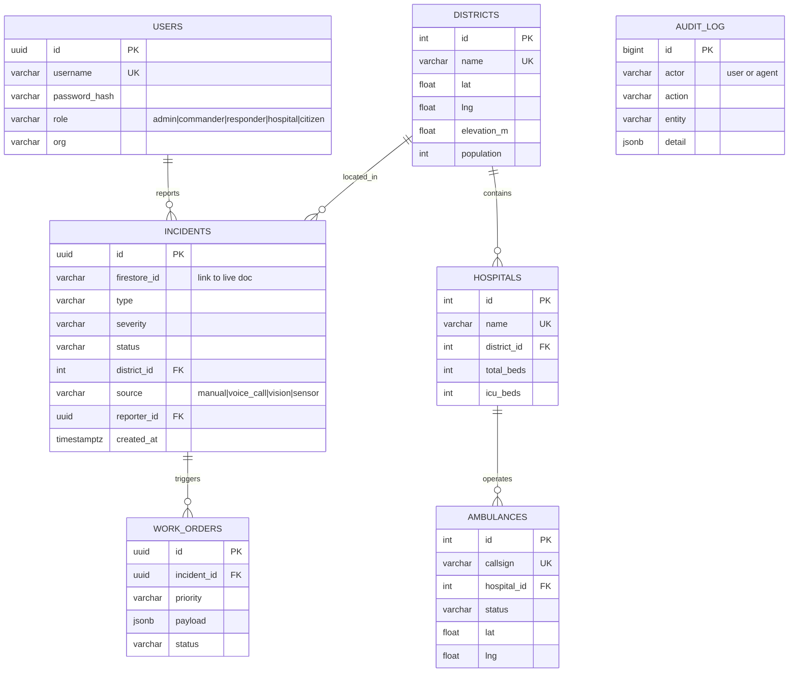

# ER Diagram — AlloyDB transactional schema

```mermaid
erDiagram
    USERS ||--o{ INCIDENTS : reports
    DISTRICTS ||--o{ HOSPITALS : contains
    DISTRICTS ||--o{ INCIDENTS : located_in
    HOSPITALS ||--o{ AMBULANCES : operates
    INCIDENTS ||--o{ WORK_ORDERS : triggers

    USERS {
        uuid id PK
        varchar username UK
        varchar password_hash
        varchar role "admin|commander|responder|hospital|citizen"
        varchar org
    }
    DISTRICTS {
        int id PK
        varchar name UK
        float lat
        float lng
        float elevation_m
        int population
    }
    HOSPITALS {
        int id PK
        varchar name UK
        int district_id FK
        int total_beds
        int icu_beds
    }
    AMBULANCES {
        int id PK
        varchar callsign UK
        int hospital_id FK
        varchar status
        float lat
        float lng
    }
    INCIDENTS {
        uuid id PK
        varchar firestore_id "link to live doc"
        varchar type
        varchar severity
        varchar status
        int district_id FK
        varchar source "manual|voice_call|vision|sensor"
        uuid reporter_id FK
        timestamptz created_at
    }
    WORK_ORDERS {
        uuid id PK
        uuid incident_id FK
        varchar priority
        jsonb payload
        varchar status
    }
    AUDIT_LOG {
        bigint id PK
        varchar actor "user or agent"
        varchar action
        varchar entity
        jsonb detail
    }
```
