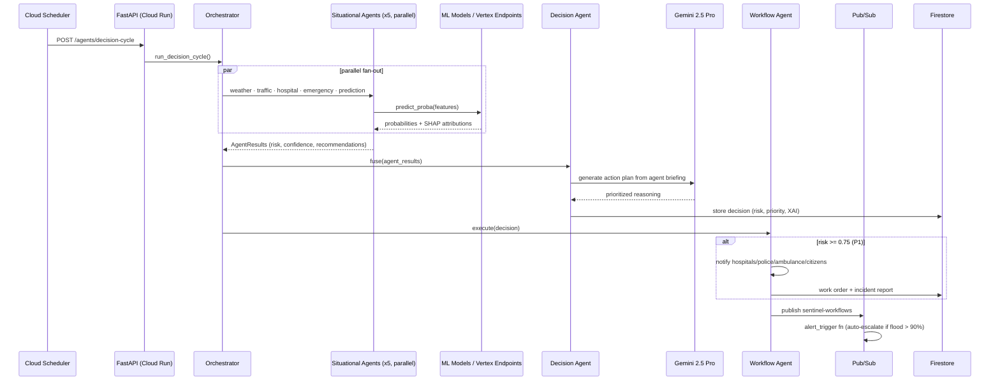
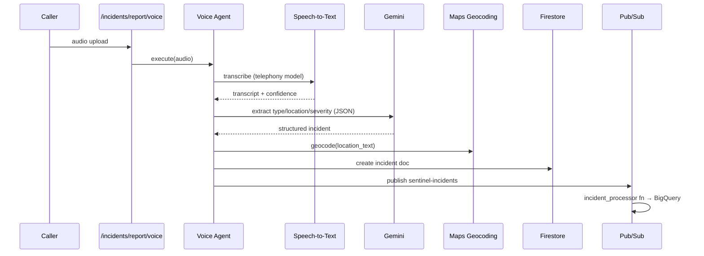
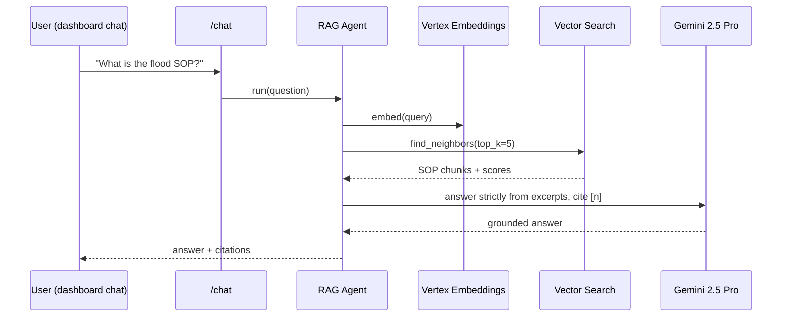

# Sequence Diagrams

## 1. Automated decision cycle (every 5 minutes)

```mermaid
sequenceDiagram
    participant CS as Cloud Scheduler
    participant API as FastAPI (Cloud Run)
    participant OR as Orchestrator
    participant SA as Situational Agents (x5, parallel)
    participant ML as ML Models / Vertex Endpoints
    participant DA as Decision Agent
    participant GM as Gemini 2.5 Pro
    participant WA as Workflow Agent
    participant PS as Pub/Sub
    participant FSt as Firestore

    CS->>API: POST /agents/decision-cycle
    API->>OR: run_decision_cycle()
    par parallel fan-out
        OR->>SA: weather · traffic · hospital · emergency · prediction
        SA->>ML: predict_proba(features)
        ML-->>SA: probabilities + SHAP attributions
    end
    SA-->>OR: AgentResults (risk, confidence, recommendations)
    OR->>DA: fuse(agent_results)
    DA->>GM: generate action plan from agent briefing
    GM-->>DA: prioritized reasoning
    DA->>FSt: store decision (risk, priority, XAI)
    OR->>WA: execute(decision)
    alt risk >= 0.75 (P1)
        WA->>WA: notify hospitals/police/ambulance/citizens
        WA->>FSt: work order + incident report
    end
    WA->>PS: publish sentinel-workflows
    PS->>PS: alert_trigger fn (auto-escalate if flood > 90%)
```

## 2. Voice emergency call intake

```mermaid
sequenceDiagram
    participant C as Caller
    participant API as /incidents/report/voice
    participant VA as Voice Agent
    participant STT as Speech-to-Text
    participant GM as Gemini
    participant MP as Maps Geocoding
    participant FSt as Firestore
    participant PS as Pub/Sub

    C->>API: audio upload
    API->>VA: execute(audio)
    VA->>STT: transcribe (telephony model)
    STT-->>VA: transcript + confidence
    VA->>GM: extract type/location/severity (JSON)
    GM-->>VA: structured incident
    VA->>MP: geocode(location_text)
    VA->>FSt: create incident doc
    VA->>PS: publish sentinel-incidents
    PS->>PS: incident_processor fn → BigQuery
```

## 3. RAG grounded answer

```mermaid
sequenceDiagram
    participant U as User (dashboard chat)
    participant API as /chat
    participant RA as RAG Agent
    participant EMB as Vertex Embeddings
    participant VS as Vector Search
    participant GM as Gemini 2.5 Pro

    U->>API: "What is the flood SOP?"
    API->>RA: run(question)
    RA->>EMB: embed(query)
    RA->>VS: find_neighbors(top_k=5)
    VS-->>RA: SOP chunks + scores
    RA->>GM: answer strictly from excerpts, cite [n]
    GM-->>RA: grounded answer
    RA-->>U: answer + citations
```
